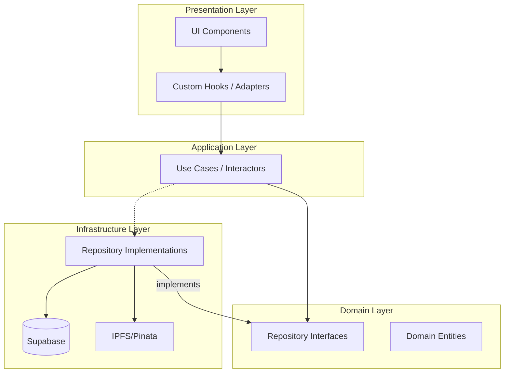

# Magical Toys: Architectural Breakdown

As a senior software architect, I have analyzed the current codebase. The application is transitioning towards a **Clean Architecture** pattern. To ensure scalability, maintainability, and clear separation of concerns, I have broken the application into the following functional modules.

## 1. Module Overview

The application is structured into four primary layers:
*   **Domain**: Core business logic and interfaces.
*   **Infrastructure**: External implementations (Supabase, IPFS, Browser APIs).
*   **Application**: Use Cases (Interactors) that orchestrate business logic. These are pure logic classes that depend on Domain interfaces.
*   **Presentation**: UI components and Hooks (Adapters). Hooks now delegate complex logic to Use Cases.

---

## 2. Functional Units

### 🔐 Authentication Module
*   **Main Responsibility**: Manages user identity, session persistence, and role-based access.
*   **Application Layer**: `AuthenticateUseCase`, `AccountUseCase`.
*   **Key Features**: Guest sessions, account upgrading, and password recovery.

### 🧸 Catalog Module
*   **Main Responsibility**: Manages the toy inventory and marketplace.
*   **Application Layer**: `LoadCatalogUseCase`, `UpdateStockUseCase`.
*   **Key Features**: Category filtering, real-time stock status, abandoned cart restoration.

### 🛒 Cart & Checkout Module
*   **Main Responsibility**: Orchestrates the shopping experience.
*   **Application Layer**: Leverages `UpdateStockUseCase` and `ManageOrdersUseCase`.

### 📦 Order & Fulfillment Module
*   **Main Responsibility**: Lifecycle management of purchases.
*   **Application Layer**: `ManageOrdersUseCase`.

### 🛠️ Administrative Module
*   **Main Responsibility**: System-wide oversight and resource management.
*   **Application Layer**: `AdminUseCase`.

### 🚚 Shipper Module
*   **Main Responsibility**: Specialized fulfillment workflow for logistics partners.
*   **Application Layer**: `ShipperUseCase`.

---

## 3. Interaction Diagram (Conceptual)

## 4. Completed Milestones

- ✅ **God Component Refactor**: `App.tsx` has been slimmed down; routing and state management are now handled by `AppRouter.tsx` and dedicated Context Providers.
- ✅ **Application Layer Formalization**: Extracted complex orchestration logic into pure **Use Cases** (e.g., `LoadCatalogUseCase`, `AuthenticateUseCase`), making hooks purely representational adapters.
- ✅ **Modular Decoupling**: `Admin` and `Shipper` modules are strictly decoupled, interacting only through shared domain entities and repository interfaces.

- ✅ **Unit Testing Use Cases**: Established a testing environment using Vitest; business logic in Use Cases is now verified with automated unit tests.
- ✅ **Centralized Error Handling**: Implemented `AppError` and a unified error mapping strategy within the Application Layer.
- ✅ **Persistence Abstraction**: Abstracted platform-specific storage (localStorage) behind the `IStorageRepository` interface, making the Application Layer platform-agnostic and easier to test.
- ✅ **DDD Refinement**: Introduced **Value Objects** (`Price`, `Email`) to eliminate primitive obsession and **Domain Events** (`OrderPlacedEvent`) to decouple side effects from core logic.
- ✅ **Integration Testing**: Established an integration test suite for the Application Layer to verify the orchestration between Use Cases, Repositories, and Events.
- ✅ **API Gateway / BFF Pattern**: Implemented an **AppGateway** to aggregate requests and provide a unified data structure for the UI initialization.
- ✅ **DDD Advanced Refinement**: Introduced specialized Value Objects (`Address`, `Phone`) and implemented the **Order Aggregate Root** to manage domain invariants and state transitions.
- ✅ **Micro-Frontend Ready Architecture**: Refactored the UI into isolated, lazy-loaded feature modules (`Admin`, `Shipper`, `Store`) and configured Module Federation infrastructure.
- ✅ **Shared UI Library (Design System)**: Extracted atomic UI components into a dedicated library (`src/shared/ui`) to ensure visual consistency and code reuse.
- ✅ **Component Documentation (Storybook)**: Implemented Storybook to document, visually test, and showcase the Shared UI Library in isolation.
- ✅ **Event-Driven Side Effects**: Implemented a central `DomainEvents` bus and specialized infrastructure handlers (e.g. `EmailNotificationHandler`) to decouple side effects from core logic.
- ✅ **Persistent Event Store (Outbox Pattern)**: Implemented a durable outbox using `localStorage` and a background `DomainEventProcessor` to guarantee "at-least-once" delivery of domain events.
- ✅ **Infrastructure Transactionality**: Implemented Supabase RPC and PL/pgSQL functions to ensure atomic persistence of orders and outbox events in a single database transaction.

## 5. Future Recommendations

1.  **Visual Regression Testing**: Integrate Chromatic or a similar tool with Storybook to automatically detect unintended visual changes in your UI components.

1.  **Distributed Tracing**: Implement correlation IDs across Domain Events and BFF requests to enable end-to-end observability of complex business flows.

3.  **Enhanced Integration Coverage**: Expand integration tests to cover the full Infrastructure implementations (Supabase) using a dedicated test database.

