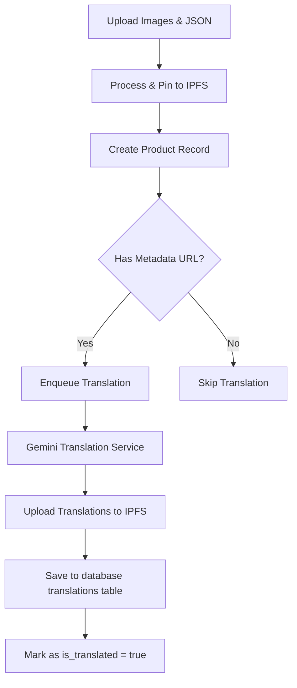

# Bulk Product Upload & Automatic Translation Pipeline

This document details how bulk product loading operates in the application and highlights the automated translation pipeline triggered during ingestion.

---

## 1. Overview of the Ingestion Flow

When an administrator or operator uploads products in bulk (via image assets and metadata JSON files), the system executes a multi-step ingestion process:



---

## 2. Ingestion Details (`BulkloadUseCase`)

During bulk upload, `BulkloadUseCase` is invoked:
1. **IPFS Pinning**: Images and metadata JSON files are pinned to IPFS via Pinata.
2. **Metadata Consolidation**: The metadata URL is resolved.
3. **Database Insertion**: `IAdminRepository.addProduct()` inserts the product details.

---

## 3. The Automatic Translation Pipeline

The translation process is fully automated and occurs as a post-insertion side effect in `SupabaseAdminRepository.addProduct()`:

### How it is Triggered:
```typescript
// Triggers translation automatically in the background via sequential queue
const geminiKey = localStorage.getItem('gemini_api_key') || (import.meta.env.VITE_GEMINI_API_KEY as string) || '';
if (data.metadata_url) {
  const baseName = data.metadata?.baseName;
  TranslationQueue.enqueue(() => 
    this.translateProductAllLanguages(data.id, data.metadata_url, data.barcode_id, geminiKey, baseName)
  );
}
```

### The Translation Steps:
1. **Metadata Retrieval**: Retrieves the original product passport payload from IPFS.
2. **Language Lookup**: Queries active localization languages in the database (e.g., Spanish, French, Italian).
3. **Gemini Processing**: Integrates with the `GeminiAnalyzerService` to translate the name, description, and durability attributes.
4. **Validation Check**: Validates the schema of the translated passport structure to ensure fields aren't corrupted or lost.
5. **Secondary IPFS Storage**: Stores the translated JSON files as separate metadata entries on IPFS.
6. **Upserts**: Inserts or updates the records in the `product_translations` table.
7. **Flag Update**: Updates the parent product record's `is_translated` column to `true`.