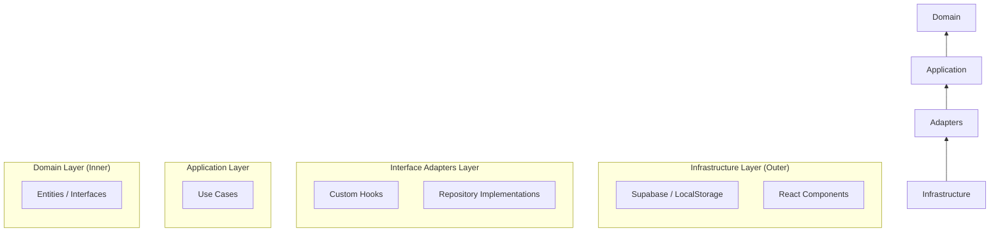

# 🏗️ Clean Architecture Guide

A comprehensive overview of Clean Architecture principles and their practical implementation in the Magical Toys project.

## 1. What is Clean Architecture?

**Clean Architecture** is a software design philosophy introduced by Robert C. Martin ("Uncle Bob"). Its primary goal is the **separation of concerns**, allowing developers to build systems that are:

-   **Independent of Frameworks**: The business logic doesn't depend on React, Express, or any specific library.
-   **Testable**: Business rules can be tested without a UI, database, or web server.
-   **Independent of the UI**: The UI can change from a web app to a mobile app without changing the business logic.
-   **Independent of the Database**: You can swap Supabase for PostgreSQL, MongoDB, or even a local JSON file without touching your core features.

---

## 2. The Dependency Rule

The most important rule in Clean Architecture is: **Dependencies can only point inwards.**

Inner circles (Entities and Use Cases) know nothing about outer circles (UI, Frameworks, Databases).

---

## 3. The Layers Explained

### 🧠 Domain Layer (The Heart)
Contains the core business logic and high-level rules.
-   **Entities**: Simple objects or classes representing your business data (e.g., `Toy`, `Order`).
-   **Interfaces**: Contract definitions for data access (e.g., `IToyRepository`).
-   **Location**: `src/domain/`

### 💼 Application Layer (The Orchestrator)
Contains application-specific business rules.
-   **Use Cases**: These are the "verbs" of your app. They perform a specific task by orchestrating entities and repositories (e.g., `AddToCartUseCase`, `PlaceOrderUseCase`).
-   **Location**: `src/application/use-cases/`

### 🎯 Interface Adapters Layer
Converts data from the format most convenient for use cases to the format most convenient for external agencies.
-   **Repositories**: Implementation of the domain interfaces using specific tools (e.g., `SupabaseToyRepository`).
-   **Hooks**: React hooks that adapt the Use Cases for the UI components.
-   **Location**: `src/infrastructure/repositories/` and `src/presentation/hooks/`

### 🔄 Frameworks & Drivers Layer (The Detail)
This is where the actual tools live.
-   **UI**: React components, CSS, and layouts.
-   **Services**: Direct SDK calls (e.g., `supabase-js`).
-   **Location**: `src/components/` and `src/services/`

---

## 4. Why Use It? (The Benefits)

1.  **"Plug-and-Play" Data**: You can switch from `localStorage` to `Supabase` by simply swapping a repository implementation.
2.  **Logic-Heavy, UI-Light**: Your React components stay "dumb" and focused only on rendering, while the complex logic lives in pure TypeScript Use Cases.
3.  **Easy Testing**: You can write unit tests for your `PlaceOrderUseCase` without actually needing to connect to a real database or fire up a browser.
4.  **Scalability**: New developers can easily find where a feature lives by looking at the `use-cases` folder.

---

## 5. Practical Example: Fetching Toys

1.  **Domain**: Defines a `Toy` type and an `IToyRepository` interface with a `fetchToys()` method.
2.  **Application**: `LoadCatalogUseCase` calls `repo.fetchToys()`.
3.  **Infrastructure**: `SupabaseToyRepository` implements `fetchToys()` using the Supabase client.
4.  **Presentation**: `useInventory` hook calls the Use Case, and `ToyList.tsx` displays the data.

---

> [!TIP]
> **Remember**: In Clean Architecture, your business logic is a "plugin" to your infrastructure, not the other way around. Keep your Use Cases pure and your Components beautiful!
