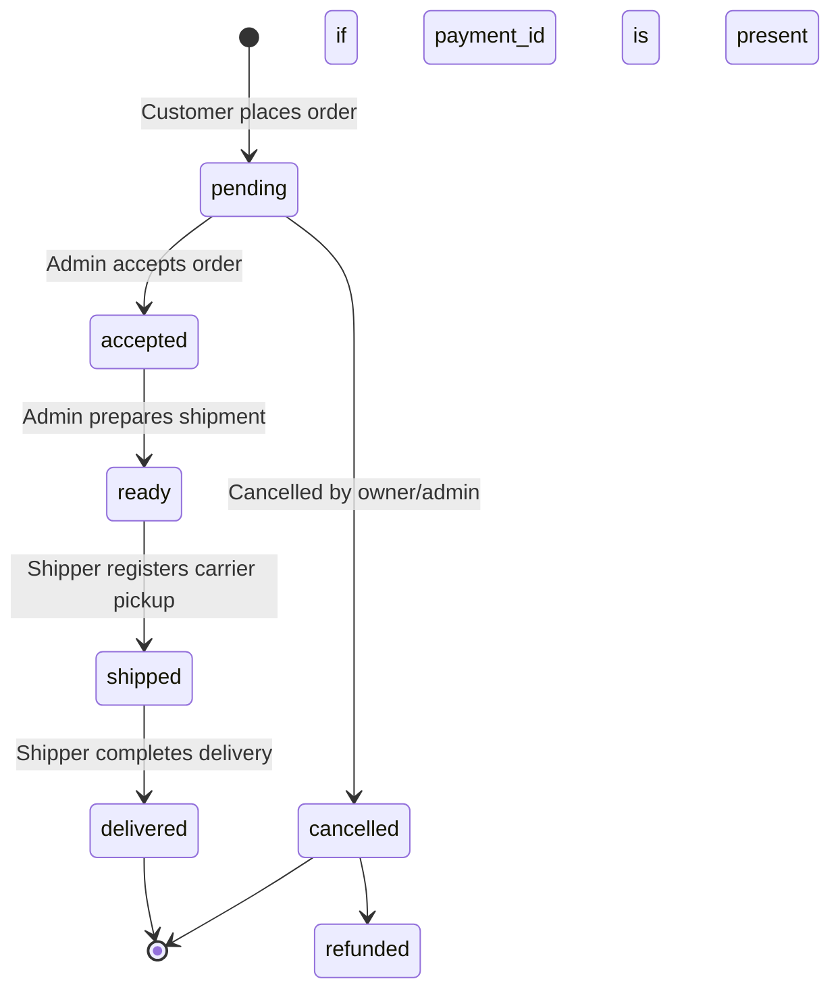

# 🧸 Magical Toys Store — Complete User Guide

Welcome to the **Magical Toys Store** user guide! This document provides a comprehensive overview of the application’s features, interactive flows, user roles, security designs, and fulfillment workflows from both customer and administrative viewpoints.

---

## 📋 Table of Contents
1. [Customer Storefront Experience](#1-customer-storefront-experience)
   * [Browsing the Catalog](#browsing-the-catalog)
   * [Interactive Cart & Smart Persistence](#interactive-cart--smart-persistence)
   * [Guest Checkout & Inline Account Upgrades](#guest-checkout--inline-account-upgrades)
2. [Guest Session Management & Order Tracking](#2-guest-session-management--order-tracking)
   * [Guest Session Persistence](#guest-session-persistence)
   * [Secure Guest Order Tracking](#secure-guest-order-tracking)
   * [Why Logging Out Clears Anonymous History](#why-logging-out-clears-anonymous-history)
3. [Order Fulfillment & Status Machine](#3-order-fulfillment--status-machine)
   * [Fulfillment States](#fulfillment-states)
   * [Atomic Order Cancellation](#atomic-order-cancellation)
4. [Role-Based Access Control (RBAC) & Portals](#4-role-based-access-control-rbac--portals)
   * [Customer Portal](#customer-portal)
   * [Shipper Portal](#shipper-portal)
   * [Operator Dashboard (Bulk Loader)](#operator-dashboard-bulk-loader)
   * [Admin Dashboard](#admin-dashboard)
5. [Security & Architectural Design](#5-security--architectural-design)

---

## 1. Customer Storefront Experience

The storefront features an interactive, theme-aware layout supporting both light and dark mode styling.

### Browsing the Catalog
* **Category Tree Sidebar**: Quickly filter products by clicking categories hierarchically.
* **Smart Search**: Real-time filtering by entering names, SKUs, or descriptions.
* **3D Interactive Product Cards**: Hovering over cards displays perspective-tilt highlights and reflection overlays for a premium visual feedback loop.

### Interactive Cart & Smart Persistence
The shopping cart manages product quantities seamlessly, persisting across page updates:
* **Stable Device Binding**: If you shop as an anonymous guest, your items are securely bound to your specific hardware using a generated `device_id` saved in `localStorage`.
* **Session Login Merging**: When you sign in to a permanent account, the system detects your guest cart and automatically merges it into your user profile cart (aggregating quantities for matching items).
* **Logout Protection**: If you sign out of a permanent profile, your cart doesn't disappear; it pivots back to the local guest cart state so you don't lose items you previously added.

### Guest Checkout & Inline Account Upgrades
During checkout, the system detects if you are shopping as a guest:
1. **Frictionless Form**: Fill out shipping details and simulated payment info.
2. **"Save my details for next time"**: An optional checkbox slides down to prompt you to enter an **Email** and **Password**.
3. **Automatic Upgrade**: Submitting the order with this option selected triggers an atomic account upgrade. Your anonymous account is permanently registered, and the new order is placed directly under your permanent profile.

---

## 2. Guest Session Management & Order Tracking

Magical Products allows complete anonymous shopping while retaining high security.

### Guest Session Persistence
Guests are created automatically in the database when choosing "Start as Guest" or checking out anonymously. As long as you do not click "Sign Out" or clear your browser data, your guest session persists via local cache, letting you return to see your order history in the dashboard.

### Secure Guest Order Tracking
If a guest changes devices or clears local data, they will lose access to their temporary profile. To address this, the **Track Order** feature allows secure retrieval of past orders:
1. Click **Track Order** in the top navigation bar or the footer.
2. Enter the **Order ID** and the registered **Email Address** or **Phone Number**.
3. The system executes a secure lookup checking both inputs. If they match, the portal renders a live progress track, delivery address, payment method, and receipts.

### Why Logging Out Clears Anonymous History
When you click **Log Out** under a guest session, the temporary Anonymous User ID is safely destroyed from the local device to protect buyer privacy. This prevents subsequent users on a shared device (like a public computer or family tablet) from viewing your order history. If you lose your guest session, you can always retrieve your receipt by navigating to the **Track Order** page.

---

## 3. Order Fulfillment & Status Machine

### Fulfillment States
All orders undergo a strict workflow. Any transition broadcasts real-time database notifications to update views instantly:

### Atomic Order Cancellation
* **Status Threshold**: Customers and admins can cancel orders while they are in the `pending` or `accepted` states.
* **Transactional Restoring**: Clicking "Cancel Order" invokes a secure backend database function (`cancel_order_with_inventory`). It updates the status and increments the toy inventory quantities back into stock atomically. If any query fails, the entire request rolls back to prevent inventory leakage.

---

## 4. Role-Based Access Control (RBAC) & Portals

The application implements Role-Based Access Control synced directly to the client via database lookup tables.

| Role | Assignment | Target Portal |
|---|---|---|
| **Customer** | Automatic on registration | Standard Storefront, Tracking, History |
| **Shipper** | Designated in database | Shipper Portal |
| **Operator** | Designated in database | Operator Dashboard (Bulk Loader) |
| **Admin** | Designated in database | Admin Dashboard + Operator Switcher |

### Customer Portal
* Accesses standard shopping features, checkout, order history, and account settings.

### Shipper Portal
Designed specifically for mobile fulfillment agents:
* **Fulfillment Queue**: Displays all orders marked as `ready`.
* **Ship Package**: Allows shippers to mark items as `shipped` once dispatch is confirmed.
* **Confirm Delivery**: Allows shippers to mark items as `delivered` upon dropping off the package. Delivered orders are cleared from the queue automatically.

### Operator Dashboard (Bulk Loader)
Designed for backend data entry personnel to ingest catalogs at scale:
* **Drag-and-Drop Ingestion**: Upload catalog data using **JSON** or **CSV** configurations.
* **Pre-Execution Preview**: Parses files locally and shows raw parameters before committing them to the live database catalog.
* **Status Console**: Shows bulk uploading progress, system capacity metrics, and logs detailed errors for failed records.

### Admin Dashboard
The complete control center for store owners:
* **Global Statistics**: Real-time charts on total sales, pending orders, and inventory health.
* **Order Pipelines**: Manage and transition orders from `pending` -> `accepted` -> `ready`.
* **Catalog Management**: Create, edit, phase out, or delete products.
* **Role Switcher**: Admin accounts are granted a custom link in their side panel to switch to the **Operator View** for bulk operations.

---

## 5. Security & Architectural Design

Magical Toys Store uses modern engineering principles to ensure scale and safety:
* **Clean Architecture Layers**: The system is separated into Domain (core models), Application (use cases), Presentation (hooks), and Infrastructure (adapters) layers. Your UI is decoupled from the underlying database provider (Supabase / Appwrite) via Dependency Injection.
* **Outbox Pattern**: Outbox event logging guarantees that database triggers are verified synchronously with checkout, protecting against order drop-offs.
* **Secure IPFS Reverse Proxy**: Store image assets securely. Standard Pinata keys are kept behind a serverless Supabase Edge Function proxy, protecting credentials from being exposed in public bundle scripts.
* **hCaptcha Check**: Checkout is protected by automated hCaptcha checks to guard against automated order bots.
