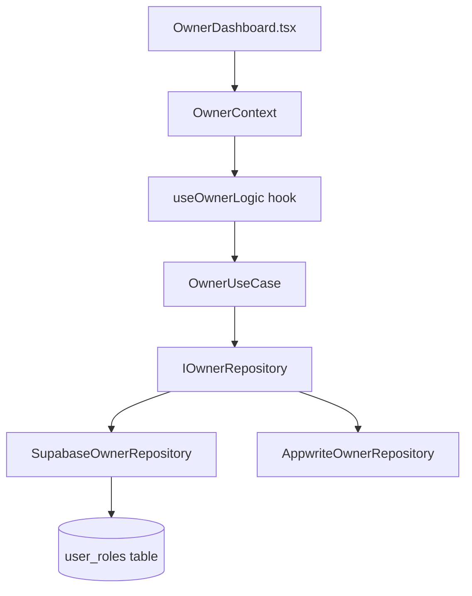

# Business Owner Dashboard — Implementation Summary

## Architecture Overview

The Business Owner dashboard follows the exact same clean architecture pattern as the existing `admin`, `shipper`, and `operator` roles:



## Files Created / Modified

| Layer | File | Purpose |
|-------|------|---------|
| **Domain** | [IOwnerRepository.ts](file:///home/paul/react/magical-products/src/domain/repositories/IOwnerRepository.ts) | Repository interface for owner role |
| **Infrastructure** | [SupabaseOwnerRepository.ts](file:///home/paul/react/magical-products/src/infrastructure/repositories/SupabaseOwnerRepository.ts) | Supabase role check (`business_owner` or `admin`) |
| **Infrastructure** | [AppwriteOwnerRepository.ts](file:///home/paul/react/magical-products/src/infrastructure/repositories/AppwriteOwnerRepository.ts) | Appwrite stub for hybrid mode |
| **Use Case** | [OwnerUseCase.ts](file:///home/paul/react/magical-products/src/application/use-cases/owner/OwnerUseCase.ts) | Thin use case layer |
| **Presentation** | [useOwnerLogic.ts](file:///home/paul/react/magical-products/src/presentation/hooks/useOwnerLogic.ts) | React hook for owner state |
| **Context** | [OwnerContext.tsx](file:///home/paul/react/magical-products/src/context/OwnerContext.tsx) | React context provider |
| **Feature** | [OwnerDashboard.tsx](file:///home/paul/react/magical-products/src/features/owner/OwnerDashboard.tsx) | Main dashboard with 10 tab views |
| **Hooks** | [useSalesMetrics.ts](file:///home/paul/react/magical-products/src/features/owner/hooks/useSalesMetrics.ts) | Hook fetching Supabase orders & calculating metrics |
| **Hooks** | [useInventoryMetrics.ts](file:///home/paul/react/magical-products/src/features/owner/hooks/useInventoryMetrics.ts) | Hook computing stock value, alerts, and PO recommendations |
| **Hooks** | [useTrafficMetrics.ts](file:///home/paul/react/magical-products/src/features/owner/hooks/useTrafficMetrics.ts) | Hook mapping five-stage conversion funnel and sources |
| **Hooks** | [useExecutiveMetrics.ts](file:///home/paul/react/magical-products/src/features/owner/hooks/useExecutiveMetrics.ts) | Hook aggregating high-level shop parameters |
| **Hooks** | [useFulfillmentMetrics.ts](file:///home/paul/react/magical-products/src/features/owner/hooks/useFulfillmentMetrics.ts) | Hook calculating prepare speed, shipping times, and carriers |
| **Hooks** | [useRefundMetrics.ts](file:///home/paul/react/magical-products/src/features/owner/hooks/useRefundMetrics.ts) | Hook computing return rates and return reasons |
| **Hooks** | [usePaymentFraudMetrics.ts](file:///home/paul/react/magical-products/src/features/owner/hooks/usePaymentFraudMetrics.ts) | Hook calculating Stripe Radar risk and dispute items |
| **Hooks** | [useCustomerServiceMetrics.ts](file:///home/paul/react/magical-products/src/features/owner/hooks/useCustomerServiceMetrics.ts) | Hook measuring client tickets and CSAT ratings |
| **Hooks** | [useMarketingMetrics.ts](file:///home/paul/react/magical-products/src/features/owner/hooks/useMarketingMetrics.ts) | Hook auditing marketing ad spends, CAC and ROAS trends |
| **Hooks** | [useOperationsMetrics.ts](file:///home/paul/react/magical-products/src/features/owner/hooks/useOperationsMetrics.ts) | Hook tracking SLA system status, bot challenges and logs |
| **Components** | [ExecutivePanel.tsx](file:///home/paul/react/magical-products/src/features/owner/components/ExecutivePanel.tsx) | Combined Sales/Traffic charts, action checklist, and ledger |
| **Components** | [SalesRevenuePanel.tsx](file:///home/paul/react/magical-products/src/features/owner/components/SalesRevenuePanel.tsx) | Metrics dashboard panel with custom interactive SVG charts |
| **Components** | [TrafficConversionPanel.tsx](file:///home/paul/react/magical-products/src/features/owner/components/TrafficConversionPanel.tsx) | Funnel stages drop-off list and referrers breakdown |
| **Components** | [InventoryStockPanel.tsx](file:///home/paul/react/magical-products/src/features/owner/components/InventoryStockPanel.tsx) | Stock alerts table, PO action buttons, and category progress bars |
| **Components** | [FulfillmentShippingPanel.tsx](file:///home/paul/react/magical-products/src/features/owner/components/FulfillmentShippingPanel.tsx) | Active shipments list, transit hours tracker, and carrier bars |
| **Components** | [ReturnsRefundsPanel.tsx](file:///home/paul/react/magical-products/src/features/owner/components/ReturnsRefundsPanel.tsx) | Refund ledger list, reason breakdown bars, and value timeline |
| **Components** | [PaymentFraudPanel.tsx](file:///home/paul/react/magical-products/src/features/owner/components/PaymentFraudPanel.tsx) | Stripe Radar checklist, payment methods share, timeline double-bars |
| **Components** | [CustomerServicePanel.tsx](file:///home/paul/react/magical-products/src/features/owner/components/CustomerServicePanel.tsx) | Helpdesk search console, CSAT status, response SLAs, channel weights |
| **Components** | [MarketingPanel.tsx](file:///home/paul/react/magical-products/src/features/owner/components/MarketingPanel.tsx) | Ad spends vs Ad Revenue overlays, blended CAC indicator, campaigns ROAS |
| **Components** | [OperationsPanel.tsx](file:///home/paul/react/magical-products/src/features/owner/components/OperationsPanel.tsx) | System exceptions database logs, SLA uptime gauges, bot blocking |
| **Tests** | [useSalesMetrics.test.ts](file:///home/paul/react/magical-products/src/features/owner/hooks/useSalesMetrics.test.ts) | Unit tests verifying math and percentage calculations |
| **Tests** | [useInventoryMetrics.test.ts](file:///home/paul/react/magical-products/src/features/owner/hooks/useInventoryMetrics.test.ts) | Unit tests verifying low-stock/out-of-stock categorization |
| **Tests** | [useTrafficMetrics.test.ts](file:///home/paul/react/magical-products/src/features/owner/hooks/useTrafficMetrics.test.ts) | Unit tests verifying conversion drop-off percentages |
| **Tests** | [useExecutiveMetrics.test.ts](file:///home/paul/react/magical-products/src/features/owner/hooks/useExecutiveMetrics.test.ts) | Unit tests verifying correlation totals and health calculations |
| **Tests** | [useFulfillmentMetrics.test.ts](file:///home/paul/react/magical-products/src/features/owner/hooks/useFulfillmentMetrics.test.ts) | Unit tests verifying transit averages and status counts |
| **Tests** | [useRefundMetrics.test.ts](file:///home/paul/react/magical-products/src/features/owner/hooks/useRefundMetrics.test.ts) | Unit tests verifying refund rate averages |
| **Tests** | [usePaymentFraudMetrics.test.ts](file:///home/paul/react/magical-products/src/features/owner/hooks/usePaymentFraudMetrics.test.ts) | Unit tests verifying gateway success rates |
| **Tests** | [useCustomerServiceMetrics.test.ts](file:///home/paul/react/magical-products/src/features/owner/hooks/useCustomerServiceMetrics.test.ts) | Unit tests verifying channel splits and CSAT percentages |
| **Tests** | [useMarketingMetrics.test.ts](file:///home/paul/react/magical-products/src/features/owner/hooks/useMarketingMetrics.test.ts) | Unit tests verifying CAC and ROAS metrics calculations |
| **Tests** | [useOperationsMetrics.test.ts](file:///home/paul/react/magical-products/src/features/owner/hooks/useOperationsMetrics.test.ts) | Unit tests verifying SLA parameters and database logs |
| **Database** | [business_owner_role_setup.sql](file:///home/paul/react/magical-products/business_owner_role_setup.sql) | SQL migration for role + RLS policies |

## 10 Report Categories

| # | Category | Status | Icon | Description |
|---|----------|--------|------|-------------|
| 1 | **Executive Dashboard** | **Completed** | LayoutDashboard | Combined KPIs, tasklist alerts, combined charts |
| 2 | **Sales & Revenue** | **Completed** | DollarSign | Daily, weekly, monthly charts, AOV, gross/net |
| 3 | **Traffic & Conversion** | **Completed** | Users | E-Commerce funnel, sessions, referrer share |
| 4 | **Inventory & Stock Alerts** | **Completed** | Package | Stock levels, PO suggestions, category allocation |
| 5 | **Fulfillment & Shipping** | **Completed** | Truck | Shipping times, carrier performance |
| 6 | **Returns & Refunds** | **Completed** | RotateCcw | Return rates, refund processing |
| 7 | **Customer Service** | **Completed** | Headphones | Support tickets, satisfaction scores |
| 8 | **Marketing & ROI** | **Completed** | Megaphone | Campaign performance, spend analysis |
| 9 | **Payment & Fraud** | **Completed** | Shield | Transaction success rates, fraud detection |
| 10 | **Operations Exceptions** | **Completed** | AlertTriangle | Error monitoring, system health |

## Report Scope Breakdown

### 1) Executive Dashboard
- **Aggregate KPI Summary Cards**: Live revenue, AOV, traffic sessions count, and overall conversion rate.
- **Combined Trend Chart**: Interactive dual-graph overlaying simulated visitor numbers (bars) and sales (line).
- **Operations Tasklist**: Action items including low-stock reorder actions (interlinked to redirect to the Inventory tab) and hCaptcha verification check status.
- **Recent Sales Ledger**: Real-time checkout transaction records showing order ID, items count, and total.

### 2) Sales & Revenue
- **Daily**: Gross/Net revenue, hourly sales velocity, AOV, top products, comparisons vs. Yesterday/Last Week/Last Month.
- **Weekly**: Daily sales breakdowns (Mon-Sun), 4-week trend sparkline, vs. previous week.
- **Monthly**: Weekly sales breakdowns, 6-month historical growth sparkline, vs. same month last year.
- **Quarterly**: Gross/Net revenue, monthly sales breakdowns (M1-M3), 4-quarter historical trend overlay, AOV, vs. previous quarter.
- **Yearly**: Gross/Net revenue, quarterly sales breakdowns (Q1-Q4), 5-year historical trend chart, AOV, vs. previous year.

### 3) Traffic & Conversion
- **Funnel Drop-offs**: Visualized 5-stage funnel tracking progression from Sessions $\rightarrow$ Product Views $\rightarrow$ Cart Additions $\rightarrow$ Checkout Started $\rightarrow$ Completed Orders.
- **Acquisition Channels**: Organic Search, Direct URL, Referral Ads, Social networks with percentage breakdown.
- **Devices breakdown**: Mobile (65%), Desktop (30%), Tablet (5%) splits.
- **Timeline visits**: Interactive hover-supported traffic density line chart.

### 4) Inventory & Stock Alerts
- **Stock planner table**: Lists all low-stock and out-of-stock items, SKU details, and recommended PO volume with estimated restock costs. Includes simulated reorder actions.
- **Value distribution**: Category-wise asset valuation split charts.
- **Recent Restocks**: Highlights newly indexed product additions.

### 5) Fulfillment & Shipping
- **Speed logs**: Average prepare speed (hours in pending/accepted status before ready) and shipping transit duration (hours in shipped status before delivered).
- **Active Tracker**: Live search-filterable tracking ledger for active shipments.
- **Carrier usage list**: Bar splits representing FedEx, DHL, UPS, USPS.

### 6) Returns & Refunds
- **Return rate**: Compiles refunds count / total payments to audit return probability.
- **Cycle analysis**: Mean days from refund claim creation to completed payment processing.
- **Reason analysis**: Segments defectives, shipping errors, buyer remorse, and late shipping complaints.

### 7) Customer Service
- **Satisfaction score**: High CSAT positive satisfaction metrics.
- **Response SLAs**: Track first reply minutes.
- **Channels**: Email support, live chat, and contact forms allocations.
- **Ledger console**: Lists incoming support inquiries with priority tags.

### 8) Marketing & ROI
- **ROI overlays**: Ad spend vs. ad-driven sales value SVG charts.
- **CAC metrics**: Customer acquisition cost calculation tracking.
- **Campaign splits**: Facebook, Instagram, organic search performance.

### 9) Payment & Fraud
- **Success vs Failures**: Audits transaction success rate.
- **Radar Checklist**: High Radar risk warnings and disputable transactions.
- **Gateway share**: Breakdown of Stripe cards, Bitcoin, Ethereum, and Solana payments.

### 10) Operations Exceptions
- **System status SLA**: Track storefront node health (uptime).
- **Bot challenge rate**: Track hCaptcha pass/block volumes.
- **Exceptions list**: Background retries and service limit event alerts log.

## Database Setup

> [!WARNING]
> Run the SQL migration `business_owner_role_setup.sql` against your remote database before testing:
> ```bash
> npx supabase db query --linked --file business_owner_role_setup.sql
> ```
