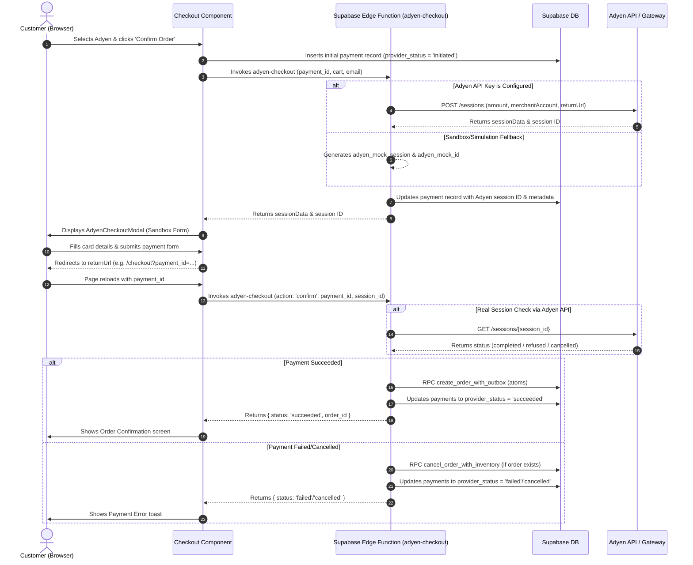

# 💳 Adyen Payment Integration Guide

Welcome to the **Adyen Payment Integration Guide** for the Magical Toys Store. This document details how Adyen payments, refunds, and webhook events are integrated across the storefront UI and the backend Supabase Edge Functions.

---

## 📋 Table of Contents
1. [Architecture Overview](#1-architecture-overview)
2. [Database Schema & Event Auditing](#2-database-schema--event-auditing)
3. [Configuration & Environment Setup](#3-configuration--environment-setup)
4. [Frontend Checkout Flow](#4-frontend-checkout-flow)
5. [Backend Edge Functions](#5-backend-edge-functions)
   * [`adyen-checkout` (Session Creation & Confirmation)](#adyen-checkout-session-creation--confirmation)
   * [`adyen-refund` (Refund Processing)](#adyen-refund-refund-processing)
   * [`adyen-webhook` (Asynchronous Verification)](#adyen-webhook-asynchronous-verification)
6. [Security, RLS & Fault Tolerance](#6-security-rls--fault-tolerance)

---

## 1. Architecture Overview

Magical Toys Store supports multiple fiat gateways. Setting `activeFiatGateway: 'adyen'` routes fiat payments through Adyen using the **Adyen Sessions API** (checkout flow) and asynchronous webhook confirmations.

Here is the transactional lifecycle of a typical Adyen checkout flow:



---

## 2. Database Schema & Event Auditing

Payment transaction records, refund histories, and state audits are tracked using specific PostgreSQL structures defined in [products_payment.sql](file:///home/paul/react/magical-products/products_payment.sql).

### Core Tables Involved
* **`public.payments`**: Stores the primary transaction info. Keeps track of the `provider` ('adyen'), `provider_status` ('initiated', 'succeeded', 'failed', 'cancelled', 'refunded'), and references the `order_id` once created.
* **`public.refunds`**: Logs requests for refunds, recording the `payment_id`, the `provider_refund_id` (Adyen's PSP reference), `amount`, and `status`.
* **`public.payment_events`**: An audit log table mapping state changes. It has an automatic PostgreSQL trigger (`log_payment_event()`) that records every transition of a payment status (e.g., `payment.initiated`, `payment.succeeded`, `payment.failed`, `payment.cancelled`).

---

## 3. Configuration & Environment Setup

The application configuration is centralized inside [appConfig.ts](file:///home/paul/react/magical-products/src/config/appConfig.ts).

### Frontend Variables
To activate Adyen, verify the following configuration in your local environment (`.env` or `.env.production`):

```env
VITE_ACTIVE_FIAT_GATEWAY=adyen
VITE_ADYEN_CLIENT_KEY=test_8390fdjka8920fhsjakldfhsa738920fh
VITE_ADYEN_ENVIRONMENT=test
```

* **`activeFiatGateway`**: Toggles standard checkout routing. Should be set to `'adyen'`.
* **`clientKey`**: Obtained from your Adyen Customer Area. Used by the Adyen SDK/Modal client.
* **`environment`**: Set to `'test'` for sandbox execution, or `'live'` for production.

### Backend Edge Secrets
Supabase Edge Functions require Deno environment variables. Set these via CLI or in the Supabase Dashboard:

```bash
supabase secrets set ADYEN_APIKEY="your-adyen-checkout-api-key"
supabase secrets set ADYEN_MERCHANT_ACCOUNT="your-merchant-account"
supabase secrets set ADYEN_PAYMENT_URL="https://checkout-test.adyen.com/v72"
```

> [!NOTE]
> If `ADYEN_APIKEY` is missing in Deno, the Edge Functions automatically degrade into a simulated sandbox experience, generating mockup credentials and letting checkout succeed locally for frictionless development.

---

## 4. Frontend Checkout Flow

The UI handles checkout in [Checkout.tsx](file:///home/paul/react/magical-products/src/features/store/components/Checkout.tsx).

### Flow Steps:
1. **Initiate Payment**: When the user clicks "Confirm Order", the client creates a blank payment record in the `payments` table and then invokes `supabase.functions.invoke('adyen-checkout')` passing the `payment_id` and the client's shopping cart.
2. **Displaying the Modal**: The UI receives the `sessionData` and `paymentId` and renders the [AdyenCheckoutModal](file:///home/paul/react/magical-products/src/features/store/components/Checkout.tsx#L2136-L2365).
3. **Sandbox Simulator**:
   * Users can choose **Credit Card**, **Sofort**, or **iDEAL** banking.
   * On submitting the simulated details, it updates browser location to the return URL: `${window.location.origin}/checkout?payment_id={paymentId}`.
4. **Order Confirmation & Closure**:
   * Upon reload, the UI detects the `payment_id` query parameter and requests the `confirm` action from `adyen-checkout`.
   * If the user closes the modal prematurely, the UI triggers a cleanup flow:
     * Calls `cancel_order_with_inventory` RPC on `adyenOrderId` (if one was provisioned).
     * Updates the payment status in the `payments` table to `'cancelled'`.

---

## 5. Backend Edge Functions

Adyen processing relies on three distinct Edge Functions located in `supabase/functions/`:

### adyen-checkout/index.ts
* **Source Path**: [adyen-checkout/index.ts](file:///home/paul/react/magical-products/supabase/functions/adyen-checkout/index.ts)
* **API endpoints handled**:
  * **Session Creation**: Receives the `payment_id`, computes the total cart price in cents, creates a payload pointing to `https://checkout-test.adyen.com/v72/sessions`, sends it to the Adyen gateway, and records details in the database.
  * **Confirmation (`action === 'confirm'`)**: Reads status from Adyen API. If `'completed'`, it runs the [create_order_with_outbox](file:///home/paul/react/magical-products/supabase/functions/adyen-checkout/index.ts#L106-L117) database RPC to create the order record atomically, update the inventory, and set the payment status in the DB to `'succeeded'`. If cancelled or refused, it updates payments to `'failed'` or `'cancelled'` and restores inventory.

### adyen-refund/index.ts
* **Source Path**: [adyen-refund/index.ts](file:///home/paul/react/magical-products/supabase/functions/adyen-refund/index.ts)
* **Functionality**:
  * Resolves a payment record via `payment_id` or `order_id`.
  * Verifies the target status is `'succeeded'`.
  * Posts a refund to the Adyen endpoint: `/payments/{pspReference}/refunds`.
  * Persists the refund in `refunds`, logs a `payment.refunded` event in `payment_events`, and switches the `orders` status to `'refunded'`.

### adyen-webhook/index.ts
* **Source Path**: [adyen-webhook/index.ts](file:///home/paul/react/magical-products/supabase/functions/adyen-webhook/index.ts)
* **Functionality**:
  * Listens to incoming asynchronous events dispatched by Adyen.
  * Implements handlers for `AUTHORISATION` notifications:
    * Succeeds or fails payment records.
    * Creates the database orders via `create_order_with_outbox` RPC if they don't yet exist.
    * Restores product stock on transaction failure via `cancel_order_with_inventory` RPC.
  * Implements handlers for `REFUND` notifications:
    * Updates corresponding payment records, refund database logs, and linked order statuses.

---

## 6. Security, RLS & Fault Tolerance

* **Row-Level Security (RLS)**: Row-level policies are configured in [products_payment.sql](file:///home/paul/react/magical-products/products_payment.sql#L183-L262). Customers can only read and write their own payment rows. Administrators retain read access to all payments.
* **RPC Inventory Protection**: Modifying stock is encapsulated inside DDL transactions (e.g. `cancel_order_with_inventory` RPC). If network faults occur during checkout confirmation, inventory allocations remain safe and rollback automatically.
* **Webhook Reliability**: The webhook endpoint responds with `[accepted]` as required by Adyen, ensuring notifications are not retried indefinitely in case of transient errors, while safely auditing results.
