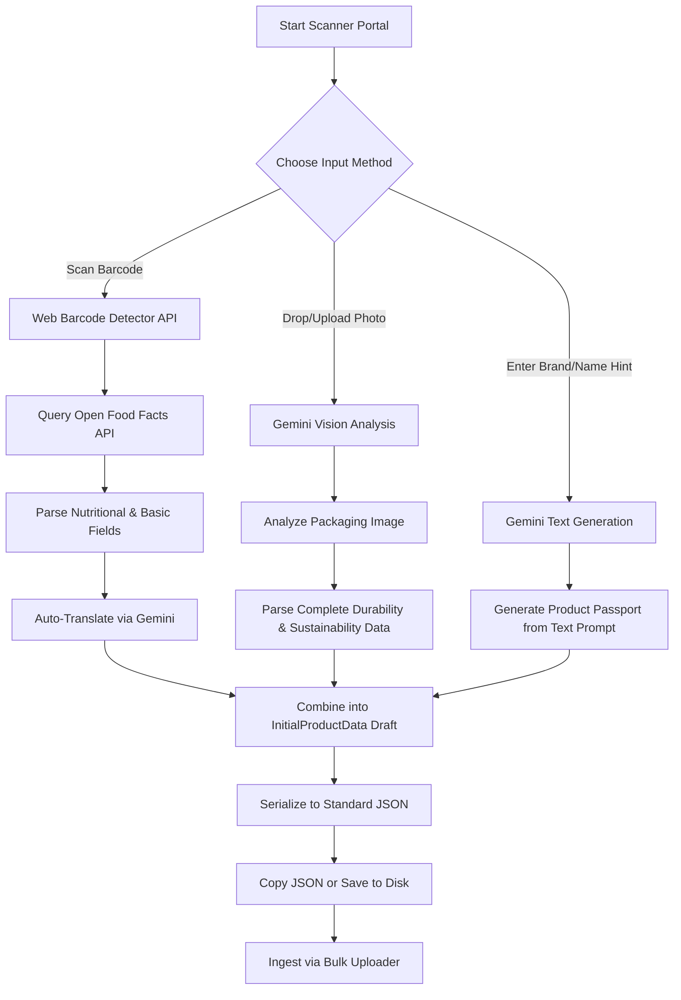

# 🔍 JSON Barcode Scanner & AI Enrichment Guide

Welcome to the **JSON Barcode Scanner & AI Enrichment Guide** for the Magical Toys Store. This document details how operators and administrators can use the Barcode Scanner interface to scan products, retrieve remote catalog listings, extract product details from packaging images using Gemini Vision, enrich information via AI prompts, and export standardized JSON passports for bulk loading.

---

## 📋 Table of Contents
1. [Workflow & Pipeline Architecture](#1-workflow--pipeline-architecture)
2. [Data Sources & APIs](#2-data-sources--apis)
3. [Key Features & Capabilities](#3-key-features--capabilities)
4. [File Structure & Core Codebases](#4-file-structure--core-codebases)
5. [Configuration & Keys](#5-configuration--keys)
6. [Operational Workflows](#6-operational-workflows)

---

## 1. Workflow & Pipeline Architecture

The JSON Barcode Scanner acts as an ingestion accelerator for the operator console. By automating product data entry, it eliminates manual typing of complex attributes (e.g., sizes, weights, ingredients, durability, and sustainability scores).

---

## 2. Data Sources & APIs

The scanner is integrated with external catalog indexes and large language models (LLMs) to retrieve attributes:

* **Open Food Facts API**: Used for standard barcode lookups (`https://world.openfoodfacts.org/api/v0/product/{barcode}.json`). It pulls general product names, ingredients lists, allergen categories, and detailed nutrition sheets.
* **Gemini Vision API (`gemini-pro-vision`)**: Triggered when a photo is snapped from the camera or uploaded. It scans product packaging text and labels to construct product categories, dimensions, recycled contents, lifespan estimates, and repair ratings.
* **Gemini Text API (`gemini-pro`)**: Triggered during "AI Enrichment" to generate full product details from basic hints (e.g., Name + Brand) and auto-translate form fields into the user's selected interface language (English, French, Spanish).

---

## 3. Key Features & Capabilities

* **Native Barcode Detection**: Utilizes the browser's native `BarcodeDetector` API to scan barcodes in real-time using device cameras.
* **Live Camera Snapshotting**: Allows users to take camera snapshots of product labels to parse text instantly.
* **Google Images Lookup Hook**: Generates search links for the scanned product name directly on Google Images to speed up asset gathering.
* **Nutritional & Sustainability Forms**: Maps items automatically to specialized data schemas:
  
  | Feature Set | Attributes Extracted |
  |---|---|
  | **Physical Dimensions** | Weight, Width, Length, Height, Dimension Unit, Color, Material |
  | **Nutritional Facts** | Calories, Sugars, Protein, Fats, Saturated Fats, Sodium, Allergens |
  | **Circular Economy** | Lifespan, Reliability, Recycled Content, Repair Rating, Spare Parts availability |
  | **Carbon Accounting** | Carbon Footprint, Environmental Footprint, Water Usage |

---

## 4. File Structure & Core Codebases

* **View Component**: [BarcodeProductScanner.tsx](file:///home/paul/react/magical-products/src/features/operator/BarcodeProductScanner.tsx)
  * Defines the camera canvas, Drag-and-Drop file uploads, localized dropdown language selectors, and form editors.
* **Presentation Hook**: [useBarcodeProductScannerLogic.ts](file:///home/paul/react/magical-products/src/presentation/hooks/useBarcodeProductScannerLogic.ts)
  * Implements Open Food Facts fetching, Gemini translation calls, and browser file picker downloads.
* **Use Case Domain**: [GenerateInitialProductDataUseCase.ts](file:///home/paul/react/magical-products/src/application/use-cases/operator/GenerateInitialProductDataUseCase.ts)
  * Validates model requirements and outputs the standardized product JSON file formats.
* **Bulk Ingestion Guide**: Details on how these files are loaded is found in the [BulkUpload-products.md](file:///home/paul/react/magical-products/BulkUpload-products.md) file.

---

## 5. Configuration & Keys

To use the AI-assisted extraction features, operators must configure a **Gemini API Key**:
1. Open the JSON Barcode Scanner dashboard.
2. Expand the **API Configuration Panel** at the top.
3. Paste a valid Gemini API Key. The key is securely saved in your browser's local storage (`localStorage.getItem('gemini_api_key')`) and is never uploaded or shared.

---

## 6. Operational Workflows

### Method A: Direct Barcode Scan
1. Click **Start Scanner**. Allow camera permissions in the browser.
2. Align the barcode within the green target indicator.
3. The system scans, fetches data from Open Food Facts, queries Gemini to translate it into your active language, and auto-populates the forms.

### Method B: Photo Packaging Analysis
1. Align the product packaging inside the camera view and click **Snap & Analyze**. Alternatively, **drag and drop** a product packaging image directly onto the camera area.
2. The Gemini Vision analyzer reads text from the label and populates the physical, nutritional, and sustainability fields.
3. Verify the generated fields and download the JSON configuration.
