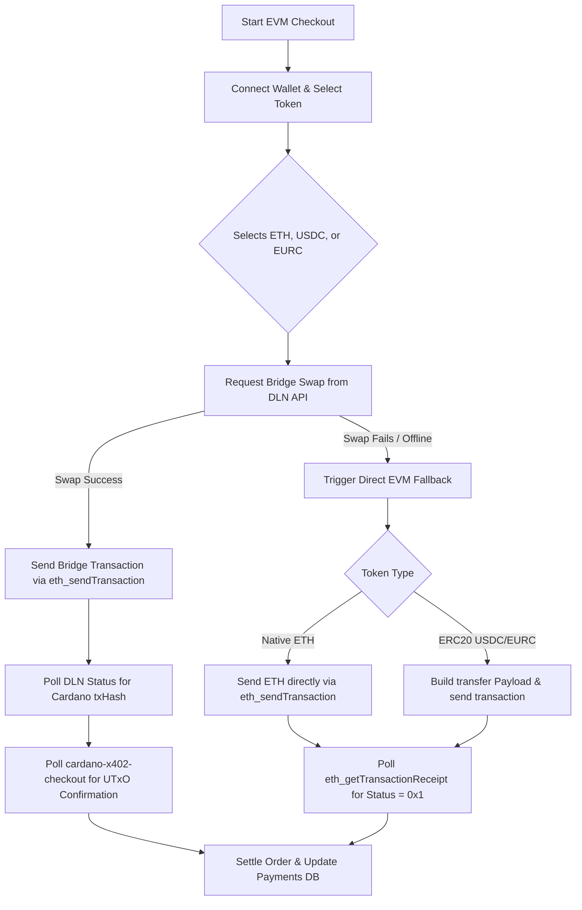

# 🌐 Ethereum EVM X402 Payment & Bridge Flow Guide

Welcome to the **Ethereum EVM X402 Payment & Bridge Flow Guide** for the Magical Toys Store. This document details how Ethereum and EVM-compatible wallets (MetaMask, Coinbase Wallet, Trust Wallet) interface with our storefront to settle payments in native ETH or ERC20 tokens (USDC, EURC) via cross-chain swaps or direct transfers.

---

## 📋 Table of Contents
1. [Workflow & Pipeline Architecture](#1-workflow--pipeline-architecture)
2. [Supported Wallets & Tokens](#2-supported-wallets--tokens)
3. [The DLN Cross-Chain Swap (Primary Routing)](#3-the-dln-cross-chain-swap-primary-routing)
4. [Direct EVM Fallback Routing](#4-direct-evm-fallback-routing)
5. [Configuration & Environment Variables](#5-configuration--environment-variables)
6. [Codebase Reference Guide](#6-codebase-reference-guide)

---

## 1. Workflow & Pipeline Architecture

EVM integrations are designed with a **two-tiered checkout routing system**. First, the storefront attempts to swap assets cross-chain into Cardano (settling in ADA or USDM at the destination). If the swap fails or is rejected, it falls back to direct EVM native/token transfers.



---

## 2. Supported Wallets & Tokens

* **Wallets**: MetaMask, Coinbase Wallet, and Trust Wallet (or any browser extension injecting standard `window.ethereum` CIP-30/EIP-1193 interfaces).
* **Tokens**:
  
  | Token Symbol | Decimals | Mainnet Contract Address | Sepolia Testnet Contract Address |
  |---|---|---|---|
  | **ETH** | 18 | `0x0000000000000000` (Native) | `0x0000000000000000` (Native) |
  | **USDC** | 6 | `0xA0b86991c6218b36c1d19D4a2e9Eb0cE3606eB48` | `0x1c7D4B196Cb0C7B01d743Fbc6116a902379C7238` |
  | **EURC** | 6 | `0x1aBaEA1f7C830F115f3590b685c7d537f20e7af8` | `0x08216865A1CDd02929fa757274092557451B38d8` |

---

## 3. The DLN Cross-Chain Swap (Primary Routing)

The storefront coordinates with the **DLN (deBridge Liquidity Network) API** to initiate a cross-chain swap routing from the client's EVM token on Ethereum into ADA or USDM on Cardano.

1. **DLN API Query**: Sends target swap parameters to `/dln/order/create-tx` (translating EVM inputs into Cardano outputs to the merchant Cardano destination address `payTo`).
2. **Transaction Submission**: Requests transaction authorization from the connected extension (`eth_sendTransaction`), executing the bridge transaction.
3. **Bridge Polling**: Polls `https://api.dln.trade/v1.0/dln/order/status?txHash={txHash}` to monitor the swap. Once the bridge deposits the swapped asset on Cardano, the DLN API returns a Cardano destination transaction hash (`dstTxHash`).
4. **On-Chain Settlement**: Submits the `dstTxHash` to the backend Edge Function `cardano-x402-checkout` with `action: 'confirm'` to verify UTxO outputs and finalize the checkout.

---

## 4. Direct EVM Fallback Routing

If the bridge swap fails, the system triggers direct payment routing to configured receiver wallets.

### Native ETH Fallback
Converts subtotal values to Wei (1e18) and requests direct transfer:
```typescript
txHash = await provider.request({
  method: 'eth_sendTransaction',
  params: [{
    from: walletAddress,
    to: receiverAddress,
    value: amountHex,
  }],
});
```

### ERC20 Token Fallback
Constructs a raw Ethereum transaction directed at the selected token contract, building an ABI-compliant `transfer(address,uint256)` data payload:
* **Function Selector**: `0xa9059cbb` (Keccak-256 hash first 4 bytes of signature).
* **Data Payload**: Concatenates `0xa9059cbb` + padded receiver address (64 chars hex) + padded token value (64 chars hex).
* Polled via `eth_getTransactionReceipt` to check transaction receipt statuses.

---

## 5. Configuration & Environment Variables

* **EVM Receiver Addresses**: Configured in [appConfig.ts](file:///home/paul/react/magical-products/src/config/appConfig.ts) inside `cryptoReceiverAddresses`:
  * `metamask`: Receiver Ethereum address.
  * `coinbase`: Receiver Ethereum address.
* **Token Addresses**: Stored in `EVM_TOKENS` block mapping.

---

## 6. Codebase Reference Guide

* **Frontend Checkout Logic**: [Checkout.tsx](file:///home/paul/react/magical-products/src/features/store/components/Checkout.tsx#L758-L1002) containing the DLN swap handler, direct EVM fallback builders, and confirmation handlers.
* **Exchange Rates**: Resolving ETH and stablecoin ratios is managed in [cryptoService.ts](file:///home/paul/react/magical-products/src/services/cryptoService.ts).
* **Cardano Verification Edge Function**: Confirms swapped funds on-chain via [cardano-x402-checkout/index.ts](file:///home/paul/react/magical-products/supabase/functions/cardano-x402-checkout/index.ts).
