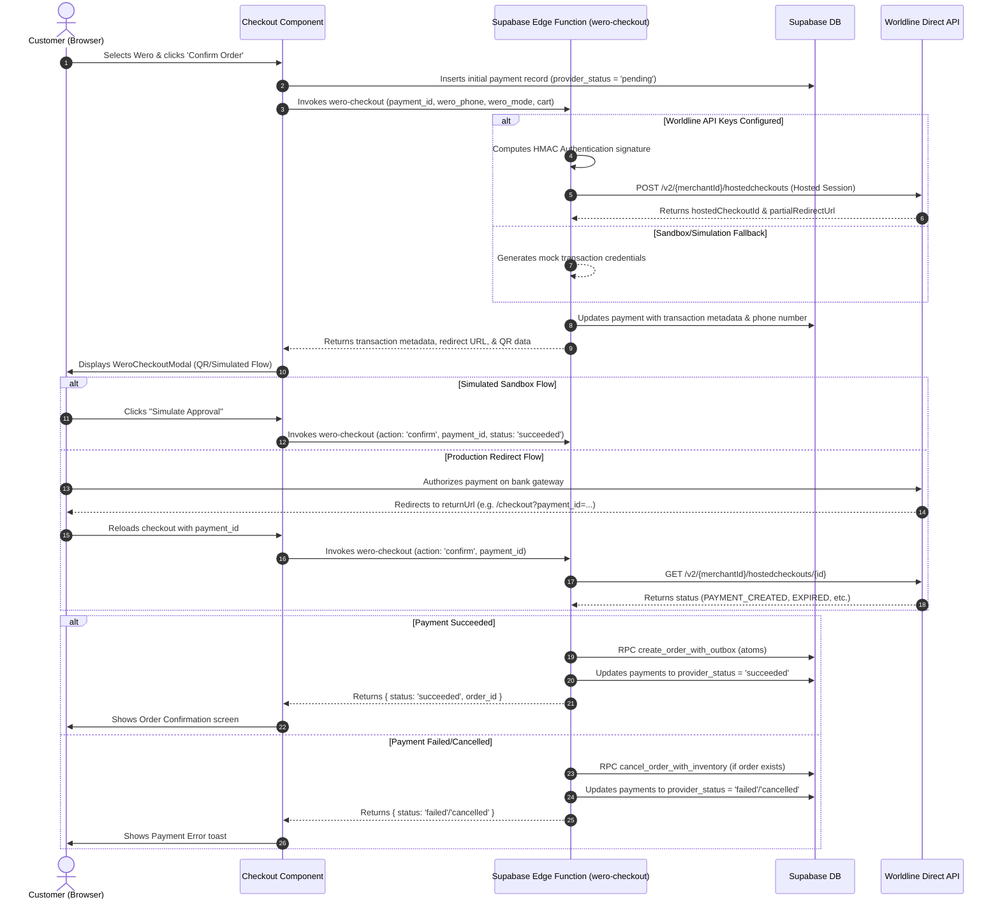

# 💳 Worldline (Wero) Payment Integration Guide

Welcome to the **Worldline Wero Payment Integration Guide** for the Magical Toys Store. This document details how Worldline Direct hosted checkout sessions (integrated with the Wero bank transfer wallet system) are handled on the frontend storefront and the backend Supabase Edge Functions.

---

## 📋 Table of Contents
1. [Architecture Overview](#1-architecture-overview)
2. [HMAC Signature & Authentication](#2-hmac-signature--authentication)
3. [Configuration & Environment Setup](#3-configuration--environment-setup)
4. [Frontend Checkout Flow](#4-frontend-checkout-flow)
5. [Backend Edge Functions](#5-backend-edge-functions)
   * [`wero-checkout` (Hosted Session & Status Checking)](#wero-checkout-hosted-session--status-checking)
   * [`wero-refund` (Refund Processing)](#wero-refund-refund-processing)
   * [`wero-webhook` (Reconciliation & Notifications)](#wero-webhook-reconciliation--notifications)
6. [Security & Error Tolerance](#6-security--error-tolerance)

---

## 1. Architecture Overview

Worldline Direct API is integrated with **Wero**, a fast mobile account-to-account bank transfer system popular in Europe.
The integration allows:
* **Interactive Frontend Checkout**: Display of QR codes or mobile phone authorization screens.
* **Preproduction API Fallbacks**: Automated fallbacks to sandbox simulations if production secrets are missing.
* **Asynchronous Webhooks**: Reconciling the payment status and instantiating orders dynamically upon successful bank transfers.



---

## 2. HMAC Signature & Authentication

All communications with the Worldline Connect API must be authenticated using custom HMAC SHA-256 signatures headers (`GCS v1HMAC`).
The signature calculation logic is built into the Supabase Edge Functions using the Deno Web Crypto API:

* **Source File**: See `getAuthorizationHeader()` in [wero-checkout/index.ts](file:///home/paul/react/magical-products/supabase/functions/wero-checkout/index.ts#L11-L47).

```ts
async function getAuthorizationHeader(
  method: string,
  path: string,
  contentType: string,
  dateStr: string,
  apiKeyId: string,
  apiSecret: string
): Promise<string> {
  const stringToHash = `${method}\n${contentType}\n${dateStr}\n${path}\n`;

  const encoder = new TextEncoder();
  const keyData = encoder.encode(apiSecret);
  const messageData = encoder.encode(stringToHash);

  const key = await crypto.subtle.importKey(
    "raw",
    keyData,
    { name: "HMAC", hash: "SHA-256" },
    false,
    ["sign"]
  );

  const signatureBuffer = await crypto.subtle.sign(
    "HMAC",
    key,
    messageData
  );

  const hashArray = new Uint8Array(signatureBuffer);
  let binaryString = "";
  for (let i = 0; i < hashArray.length; i++) {
    binaryString += String.fromCharCode(hashArray[i]);
  }
  const signatureBase64 = btoa(binaryString);

  return `GCS v1HMAC:${apiKeyId}:${signatureBase64}`;
}
```

---

## 3. Configuration & Environment Setup

Configure Worldline properties inside [appConfig.ts](file:///home/paul/react/magical-products/src/config/appConfig.ts).

### Frontend Variable Exposing
Enable Worldline in the payment selector by adding it to the `paymentMethods` array and providing credentials:

```typescript
paymentMethods: ["stripe", "adyen", "digital_euro", "paypal", "worldline", "crypto"],
wero: {
  sandboxUrl: "https://api.sandbox.wero-wallet.eu/v1",
  merchantId: "mid_magical_prod_test_90432",
  apiKey: "wero_sb_key_9083fdjklaf984"
}
```

### Backend Secrets Setup
Ensure Deno backend has these secrets loaded inside your Supabase CLI/Cloud instance:

```bash
supabase secrets set WORLDLINE_PAYMENT_APIKEY_ID="your-worldline-api-key-id"
supabase secrets set WORLDLINE_PAYMENT_APIKEY_SECRET="your-worldline-api-key-secret"
supabase secrets set WORLDLINE_PAYMENT_URL="https://payment.preprod.direct.worldline-solutions.com"
supabase secrets set WORLDLINE_MERCHANT_ID="your-merchant-id"
```

---

## 4. Frontend Checkout Flow

The client checkout interface is declared in [Checkout.tsx](file:///home/paul/react/magical-products/src/features/store/components/Checkout.tsx).

* **Modal Selector**: Renders the custom [WeroCheckoutModal](file:///home/paul/react/magical-products/src/features/store/components/Checkout.tsx#L2502-L2585).
* **Payment Modes**:
  1. **Phone Mode**: Asks for the customer's phone number and updates the state to "Awaiting authorization".
  2. **QR Mode**: Displays a simulated QR code redirect data package (`wero://pay?...`) for scan-to-pay authorization.
* **Simulator Integration**: In Sandbox mode, users have buttons to "Simulate Approval" or "Simulate Failure", triggering direct Edge Function updates.

---

## 5. Backend Edge Functions

### wero-checkout
* **Source Code**: [wero-checkout/index.ts](file:///home/paul/react/magical-products/supabase/functions/wero-checkout/index.ts)
* **Actions**:
  * **Session Creation**: Configures `hostedCheckoutSpecificInput` payloads, calculates the required `GCS v1HMAC` headers, and calls Worldline `/hostedcheckouts` endpoint.
  * **Status Confirmation**: Requests current session state from Worldline GET endpoint using `hostedcheckouts/{hostedCheckoutId}`. If categorized as `SUCCESSFUL` or status is `CAPTURED`/`AUTHORISED`, it executes the `create_order_with_outbox` DB RPC.

### wero-refund
* **Source Code**: [wero-refund/index.ts](file:///home/paul/react/magical-products/supabase/functions/wero-refund/index.ts)
* **Actions**:
  * Matches the payment/order records, builds signatures, and issues requests to `/v2/{merchantId}/payments/{worldlinePaymentId}/refund`.
  * Logs refund transactions inside `refunds` table, maps audit trails in `payment_events`, and changes the order state to `'refunded'`.

### wero-webhook
* **Source Code**: [wero-webhook/index.ts](file:///home/paul/react/magical-products/supabase/functions/wero-webhook/index.ts)
* **Actions**:
  * Receives asynchronous confirmation notifications directly from Worldline.
  * Reconciles transaction status to success/failure. Runs `create_order_with_outbox` RPC for successful webhooks, or cancels orders and restores inventory on failure.

---

## 6. Security & Error Tolerance

* **RPC Inventory Security**: Modifying inventory and creating order rows is handled atomically in database-level transactions, protecting against checkout failures and connection dropouts.
* **Signature Protection**: HMAC client IDs and secrets are processed strictly backend-side in Edge Functions, never leaking details to customer clients.
* **Row-Level Security (RLS)**: Transaction histories and refund logs are protected by RLS rules (defined in [products_payment.sql](file:///home/paul/react/magical-products/products_payment.sql)). Customers can only query their own transactions.
