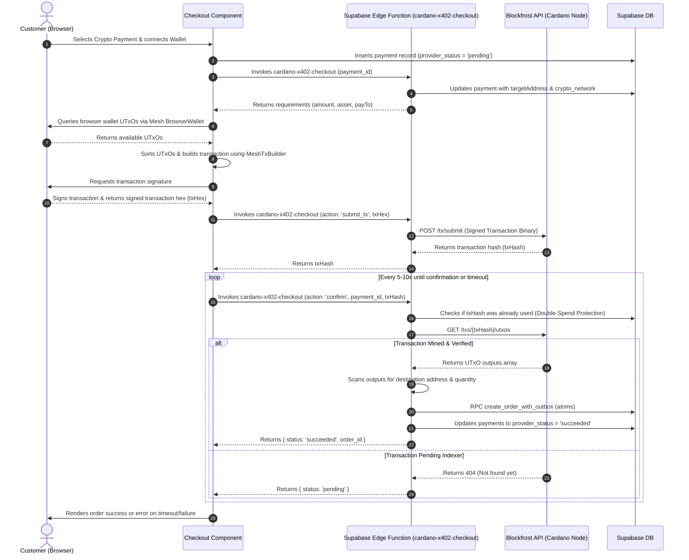

# 🪙 Cardano X402 Payment Integration Guide

Welcome to the **Cardano X402 Payment Integration Guide** for the Magical Toys Store. This document details how Cardano cryptocurrency payments (ADA/Lovelace and USDM stablecoins) are processed, verified on-chain, and audited using the **Mesh SDK** on the client storefront and serverless **Supabase Edge Functions** integrated with the **Blockfrost API**.

---

## 📋 Table of Contents
1. [What is X402 Payment?](#1-what-is-x402-payment)
2. [Architecture & Lifecycle Diagram](#2-architecture--lifecycle-diagram)
3. [Configuration & Environment Variables](#3-configuration--environment-variables)
4. [Client Storefront Implementation (Mesh SDK)](#4-client-storefront-implementation-mesh-sdk)
5. [Backend Edge Functions](#5-backend-edge-functions)
   * [`cardano-x402-checkout` (Submit & Confirm Verification)](#cardano-x402-checkout-submit--confirm-verification)
   * [`cardano-x402-refund` (Off-Chain Refund Request)](#cardano-x402-refund-off-chain-refund-request)
6. [Security & Double-Spend Protection](#6-security--double-spend-protection)

---

## 1. What is X402 Payment?

**X402** is a custom Cardano blockchain integration aligned with HTTP Status **402 (Payment Required)**. 
Instead of relying on third-party centralized crypto gateways, this application utilizes:
* **Mesh SDK** on the frontend to interface with CIP-30 compatible Cardano wallets (e.g. Eternl, Lace).
* **Blockfrost API** on the backend to interact with the Cardano preproduction testnet or mainnet directly.
* **USDM Token** (stablecoin) or **ADA** (native currency) for payment value settlement.

---

## 2. Architecture & Lifecycle Diagram

The X402 flow is completely node-less, executing cryptographic assembly on the browser and verification on serverless Edge Functions:



---

## 3. Configuration & Environment Variables

System-wide properties are declared in [appConfig.ts](file:///home/paul/react/magical-products/src/config/appConfig.ts).

### Frontend Variables
To adjust fees or wallet destination addresses:
* `cryptoReceiverAddresses.lace` or `cryptoReceiverAddresses.phantom` / `cryptoReceiverAddresses.metamask`.
* `x402CardanoNetworkFeeLovelace`: Set to `200000` (representing `0.2 ADA` standard Cardano network fee).

### Backend Edge Secrets
Set these secrets inside Supabase environment variables:

```bash
supabase secrets set BLOCKFROST_PROJECT_ID="your-blockfrost-project-id"
supabase secrets set CARDANO_NETWORK="preprod" # preprod or mainnet
supabase secrets set CARDANO_TARGET_ADDRESS="your-receiving-wallet-address"
supabase secrets set CARDANO_USDM_POLICY_ASSET="c4868454a43be0a4f5f5f5f5f5f5f5f5f5f5f5f5f5f5f5f5f5f5f5f55553444d"
```

* **`CARDANO_USDM_POLICY_ASSET`**: The unique asset fingerprint of the USDM token on the targeted network.

---

## 4. Client Storefront Implementation (Mesh SDK)

The frontend transaction logic is housed in [Checkout.tsx](file:///home/paul/react/magical-products/src/features/store/components/Checkout.tsx#L535-L690).

### Core Steps:
1. **Wallet Enablement & Token Selection**:
   * Loads wallet connection object:
     ```typescript
     const wallet = await BrowserWallet.enable(connectedWallet);
     const utxos = await wallet.getUtxos();
     ```
   * Users can choose to pay with either **ADA** or **USDM**. If USDM is selected, the exchange rate is automatically pegged to the live `usdcRate` (relative to the Euro base price).
2. **UTxO Selection & Sorting**:
   * Sorts wallet UTxOs. If the user is paying with USDM, the sorting algorithm prioritizes UTxOs containing USDM assets first.
   * Selects the minimum subset of inputs that cover:
     * The required **ADA/Lovelaces** (minimum 1.0 ADA output to the merchant + 0.2 ADA network fee).
     * The required **USDM** token quantity (if paying with USDM).
3. **Transaction Assembly**:
   * Uses `MeshTxBuilder` to specify inputs (`txIn()`) and outputs (`txOut()`).
   * **Merchant Output**: If paying with Lovelace, outputs the required ADA. If paying with USDM, outputs a bundled transaction containing 1.0 ADA (the minimum Cardano UTxO value) and the required USDM tokens.
   * **Change Output**: Calculates remaining balances. If there is custom token change, it merges both the Lovelace change and the USDM change into a single unified output back to the user's `changeAddr` to avoid extra minimum ADA fees.
4. **Sign & Submit**: The user signs the unbalanced transaction via browser popup. The signed hex is sent to the `cardano-x402-checkout` edge function, which submits it to Cardano.
5. **Reconciliation Loop**: The client enters a polling loop, querying the edge function every few seconds to check if the transaction is mined on-chain.

---

## 5. Backend Edge Functions

### cardano-x402-checkout
* **Source Path**: [cardano-x402-checkout/index.ts](file:///home/paul/react/magical-products/supabase/functions/cardano-x402-checkout/index.ts)
* **Routes**:
  * **Initiate Route**: Assigns the backend `targetAddress` and `cardanoNetwork` requirements, updating the `payments` record.
  * **Submit Route (`action === 'submit_tx'`)**: Converts signed transaction hex strings into binary format and posts to Blockfrost's `/tx/submit` endpoint.
  * **Confirm Route (`action === 'confirm'`)**: Checks Blockfrost `/txs/{txHash}/utxos` to verify that the required ADA or USDM amount has landed at the target address. Upon success, executes the `create_order_with_outbox` RPC and saves status `'succeeded'`.

### cardano-x402-refund
* **Source Path**: [cardano-x402-refund/index.ts](file:///home/paul/react/magical-products/supabase/functions/cardano-x402-refund/index.ts)
* **Routes**:
  * Lookup the payment records using `payment_id` or `order_id`.
  * Resolves the original sender Cardano address by querying original inputs (`/txs/{txHash}/utxos` inputs index 0).
  * Logs the refund request in `refunds` table, maps the audit trail in `payment_events`, and moves payment state to `'pending_refund'` for secure manual signing or off-chain dispatch.

---

## 6. Security & Double-Spend Protection

* **Double-Spend Protection**: During confirmation, the checkout function validates if the provided transaction hash has already been marked as succeeded on another payment ID (`crypto_transaction_hash` uniqueness check). This prevents malicious users from submitting the same transaction hash to redeem multiple orders.
* **RPC Inventory Protection**: Inventory decrements and order creation occur atomically in database functions. If transactions fail to verify or time out, the order is cancelled via `cancel_order_with_inventory` RPC, releasing the reserved stock.
* **Row-Level Security (RLS)**: Users can query only their own transactions, while admins retain global visibility of the crypto payments log.
