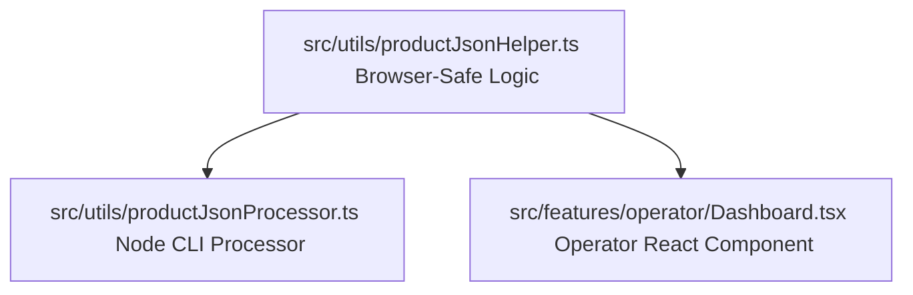

# Product JSON Processor Integration Walkthrough

We have successfully created the product JSON processor utility, added test coverage, and integrated it into the Operator Dashboard.

---

## 🛠️ Implementation Architecture

To ensure consistency and compatibility, the logic is divided into two parts:



1. **`productJsonHelper.ts`**: Pure, environment-agnostic validation and name renaming functions that run safely in both Node.js and browser environments.
2. **`productJsonProcessor.ts`**: Node.js CLI script wrapper using `fs/promises` that operates locally on directories.
3. **`Dashboard.tsx`**: Operator frontend UI that parses scanned files, validates them, and triggers a direct browser download of the renamed JSON.

---

## 💻 CLI Usage

The CLI utility runs locally to scan directories and output sanitized JSON metadata files.

```bash
# Process metadata files inside a folder
npx tsx src/utils/productJsonProcessor.ts <input_dir>
```

### Script Execution Example
If you run it on a folder containing a JSON metadata file with name `EcoDry Wool Dryer Balls (6-Pack)`, the utility will:
1. Validate structural compliance against `InitialProductData`.
2. Generate a sanitized filename: `ecodry_wool_dryer_balls_(6-pack).json`.
3. Save the new file structure inside the target directory.

---

## 🖥️ Operator Dashboard UI Integration

The **Operator Portal** now includes support for triggering this utility dynamically:

- **Folder Selection**: When operators click **Scan Local Folder**, the dashboard scans the selected directory.
- **Detailed Statistics**: The stats cards show the total number of files, split between image assets and JSON metadata.
- **Action Button**: A **Process JSON Files** button is dynamically enabled if scanned metadata is found.
- **Ingestion Log Stream**: Activity logs (successful conversions, schema validation errors, and file write events) are output to the terminal in real time.
- **Browser Download Flow**: For each valid metadata file, the application triggers a browser file download of the sanitized JSON document.

---

## 🧪 Tests Verification

We've added Vitest coverage in `src/utils/productJsonProcessor.test.ts`. Run the tests via:

```bash
npm run test:run
```

All 6 unit and integration tests are passing.
